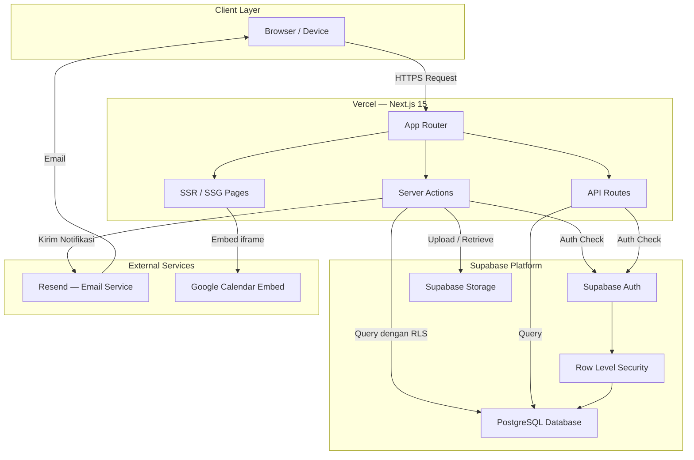
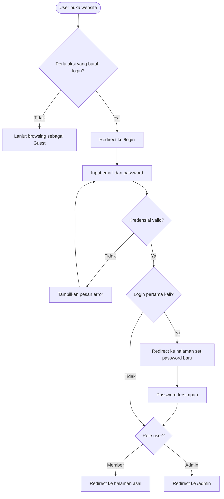
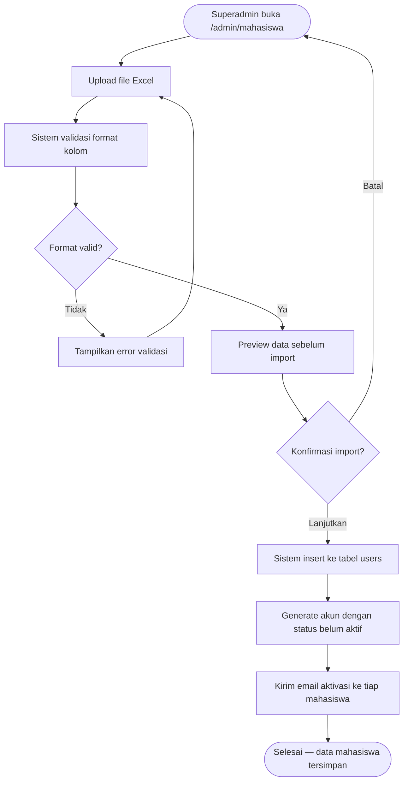
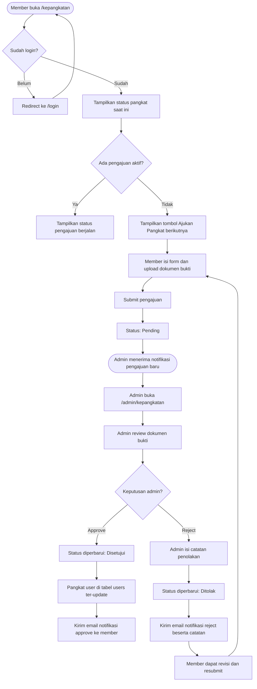
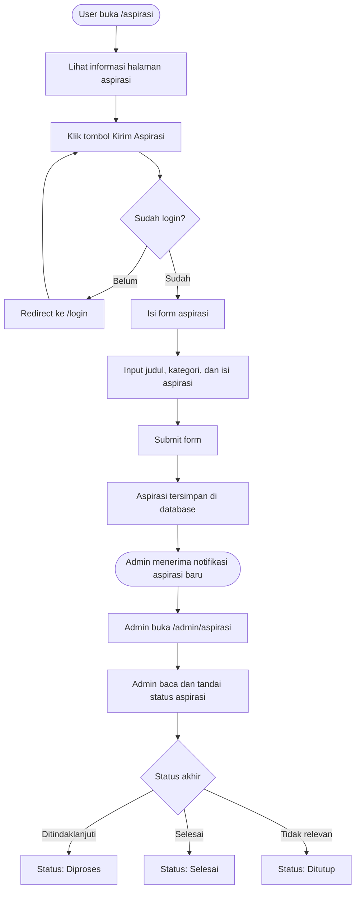
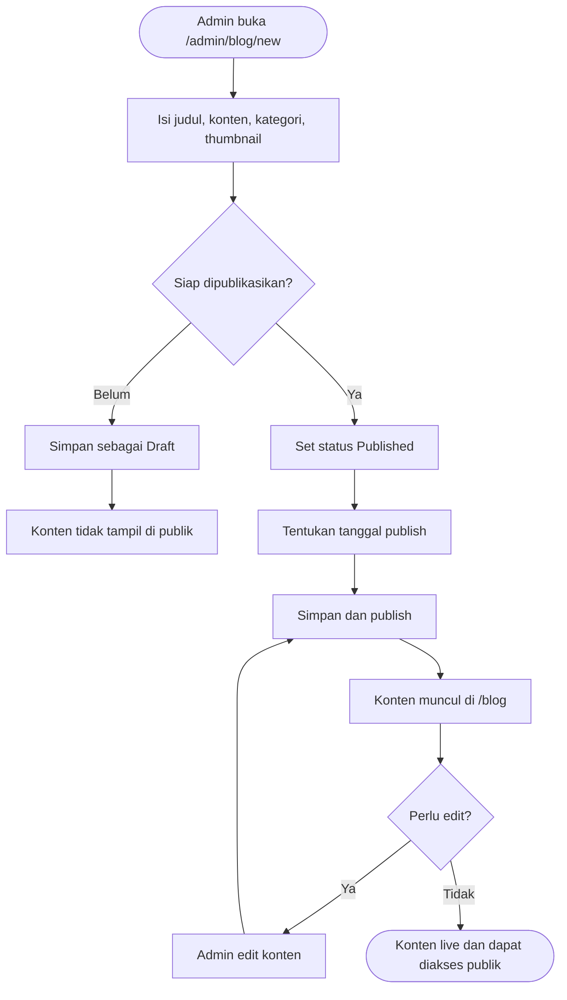
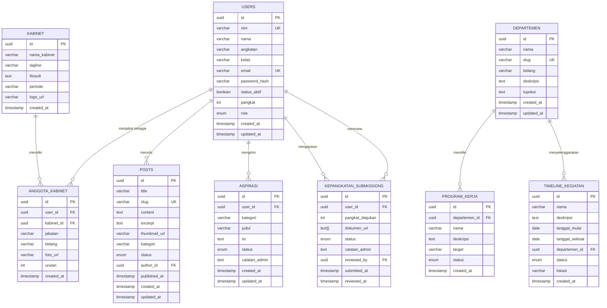

# Product Requirements Document
# Website Himpunan Mahasiswa Teknik Informatika (HIMATIF)
# Universitas Logistik dan Bisnis Internasional (ULBI)

**Versi:** 1.0  
**Tanggal:** Juni 2026  
**Status:** Draft  
**Disusun oleh:** Departemen Media dan Branding HIMATIF

---

## Daftar Isi

1. [Overview](#1-overview)
2. [Latar Belakang](#2-latar-belakang)
3. [Target Pengguna](#3-target-pengguna)
4. [Scope dan Out of Scope](#4-scope-dan-out-of-scope)
5. [Core Features](#5-core-features)
6. [Sitemap dan Route Structure](#6-sitemap-dan-route-structure)
7. [Tech Stack dan Diagram Arsitektur](#7-tech-stack-dan-diagram-arsitektur)
8. [Workflow](#8-workflow)
9. [Entity Relationship Diagram](#9-entity-relationship-diagram)
10. [Non-Functional Requirements](#10-non-functional-requirements)
11. [Design System Reference](#11-design-system-reference)
12. [Milestones dan Phasing](#12-milestones-dan-phasing)

---

## 1. Overview

Website HIMATIF adalah platform digital resmi Himpunan Mahasiswa Teknik Informatika Universitas Logistik dan Bisnis Internasional (ULBI) yang menggabungkan tiga fungsi utama dalam satu sistem terpadu: company profile organisasi, content management system (CMS) untuk publikasi informasi, dan sistem manajemen internal keanggotaan.

Platform ini dirancang untuk memperkuat branding HIMATIF secara digital, mempermudah distribusi informasi kepada mahasiswa dan publik, serta mengotomatisasi proses administratif internal seperti pengajuan kepangkatan dan pengelolaan aspirasi anggota.

Website ini dibangun untuk mendukung operasional kabinet HIMATIF periode 2026-2027 dan seluruh mahasiswa aktif Program Studi Teknik Informatika ULBI.

---

## 2. Latar Belakang

HIMATIF sebagai organisasi kemahasiswaan tingkat program studi belum memiliki platform digital terpusat yang mencerminkan identitas dan profesionalisme organisasi. Kebutuhan informasi mengenai kabinet, struktur organisasi, program kerja, dan kegiatan selama ini disebarkan secara fragmen melalui media sosial tanpa dokumentasi yang terstruktur dan persisten.

Di sisi internal, proses administratif seperti pengajuan kepangkatan dan penerimaan aspirasi anggota masih dilakukan secara manual atau melalui saluran tidak resmi, menyebabkan tidak adanya transparansi status, dokumentasi yang lemah, dan beban kerja pengurus yang tidak efisien.

Dengan dibangunnya platform ini, HIMATIF akan memiliki:

- Identitas digital resmi yang profesional dan konsisten
- Saluran publikasi konten yang terkelola dan berdokumentasi
- Sistem administrasi internal yang transparan dan terukur
- Arsip organisasi yang berkelanjutan lintas periode kabinet

---

## 3. Target Pengguna

### 3.1 Pengunjung Umum (Guest)

Siapapun yang mengakses website tanpa login, termasuk mahasiswa baru, alumni, dosen, pihak eksternal kampus, atau sponsor potensial. Kebutuhan utamanya adalah mendapatkan informasi tentang HIMATIF, mengenal kabinet dan program kerja, serta membaca konten yang dipublikasikan.

### 3.2 Mahasiswa TI Aktif (Member)

Seluruh mahasiswa aktif Program Studi Teknik Informatika ULBI yang terdaftar dalam sistem. Selain dapat mengakses semua konten publik, member dapat melakukan submit aspirasi dan mengajukan serta memantau status kepangkatan mereka.

### 3.3 Admin / Pengurus BPH (Admin)

Pengurus inti HIMATIF yang memiliki akses penuh ke dashboard admin. Bertanggung jawab mengelola seluruh konten website, memproses pengajuan kepangkatan, dan meninjau aspirasi yang masuk. Admin dibedakan menjadi dua sub-level:

- **Superadmin:** Ketua umum atau yang ditunjuk, memiliki akses penuh termasuk manajemen akun pengguna dan import data mahasiswa.
- **Admin:** Pengurus BPH, memiliki akses ke konten dan fitur yang relevan dengan departemen masing-masing.

---

## 4. Scope dan Out of Scope

### 4.1 In Scope (v1 — MVP Launch)

- Landing page dengan hero, kabinet highlight, sejarah, visi misi, dan CTA artikel
- Halaman kabinet dengan filosofi, branding, dan struktur organisasi lengkap
- Halaman departemen dengan detail tupoksi dan program kerja per departemen
- Blog dan CMS untuk publikasi artikel, berita, dan pengumuman
- Halaman timeline kegiatan dengan kalender interaktif (embed Google Calendar)
- Halaman kontak dengan form pesan dan informasi kontak resmi
- Halaman aspirasi dengan form submit (login required)
- Halaman kepangkatan dengan informasi syarat, form pengajuan, dan tracking status (login required)
- Dashboard admin: manajemen blog, konten kabinet dan departemen, inbox aspirasi, manajemen kepangkatan
- Sistem autentikasi untuk member dan admin
- Import data mahasiswa via file Excel

### 4.2 Out of Scope (v2 dan seterusnya)

- Integrasi Google Calendar via API penuh (v1 menggunakan embed iframe)
- Notifikasi via WhatsApp atau Telegram
- Direktori anggota publik
- Sistem poin atau SKP otomatis
- Forum diskusi internal
- Integrasi dengan sistem akademik kampus (SIAK)
- Aplikasi mobile native

---

## 5. Core Features

### 5.1 Company Profile

Menampilkan identitas HIMATIF secara menyeluruh mulai dari sejarah organisasi, visi dan misi, profil kabinet aktif, filosofi kabinet, hingga struktur organisasi secara hierarkis dari ketua hingga seluruh departemen. Semua konten ini dapat dikelola melalui dashboard admin.

### 5.2 Halaman Departemen

Setiap departemen dan bidang memiliki halaman tersendiri yang menampilkan deskripsi, tupoksi, fungsi, dan daftar program kerja yang sedang atau telah dilaksanakan. Hierarki yang ditampilkan:

```
BPH (Sekretaris, Bendahara)
Bidang PSDM
  - Departemen Kaderisasi
  - Departemen Advokasi
  - Departemen Minat dan Bakat
Bidang KOMINFO
  - Departemen Medinfo
  - Departemen Humas
Bidang RISTEK
  - Departemen Akademik
  - Departemen Pelatihan
```

### 5.3 Blog dan CMS

Sistem penerbitan konten dengan rich text editor (Tiptap) yang mendukung heading, gambar, link, dan format teks. Konten dikategorikan dan dapat difilter. Admin dapat membuat, mengedit, mempublikasikan, atau menarik konten kapan saja.

### 5.4 Timeline Kegiatan

Kalender interaktif yang menampilkan kegiatan HIMATIF yang telah berlalu, sedang berjalan, dan akan datang. Pada v1 menggunakan Google Calendar embed. Data kegiatan juga disimpan di database untuk keperluan tampilan list dan filtering.

### 5.5 Form Aspirasi

Form pengiriman aspirasi, kritik, dan saran dari mahasiswa kepada HIMATIF. Memerlukan login untuk memastikan identitas pengirim, namun admin dapat memilih untuk menampilkan atau tidak menampilkan identitas saat meninjau. Admin menerima dan mengelola inbox aspirasi di dashboard.

### 5.6 Sistem Kepangkatan

Sistem pengajuan dan manajemen kepangkatan mahasiswa TI dengan alur:

- Pangkat 1: Mengikuti mata kuliah proyek
- Pangkat 2: Pengabdian kepada masyarakat atau publish buku/jurnal
- Pangkat 3: Mengikuti proyek, pengabdian kepada masyarakat, dan publish buku/jurnal (semua syarat harus terpenuhi)

Pengajuan bersifat sequential — pangkat 2 hanya bisa diajukan setelah pangkat 1 disetujui. Mahasiswa mengupload dokumen bukti, admin mereview dan memberikan keputusan approve atau reject beserta catatan.

### 5.7 Autentikasi dan Manajemen Akun

Sistem login untuk member dan admin menggunakan email dan password. Data akun member bersumber dari import Excel yang dilakukan oleh superadmin. Member melakukan aktivasi akun pada login pertama.

### 5.8 Dashboard Admin

Panel administrasi terpusat yang mencakup:

- CRUD konten blog dan pengumuman
- CRUD profil kabinet dan anggota
- CRUD departemen dan program kerja
- CRUD timeline dan kegiatan
- Inbox dan manajemen aspirasi
- Review dan keputusan pengajuan kepangkatan
- Import data mahasiswa (superadmin only)
- Manajemen akun pengguna (superadmin only)

---

## 6. Sitemap dan Route Structure

```
/                          Public — Landing page
/kabinet                   Public — Profil kabinet aktif dan struktur organisasi
/departement               Public — Daftar semua departemen
/departement/[slug]        Public — Detail per departemen
/blog                      Public — Daftar artikel dan pengumuman
/blog/[slug]               Public — Detail artikel
/timeline                  Public — Kalender kegiatan
/contact                   Public — Informasi kontak dan form pesan
/aspirasi                  Public (view) / Member (submit)
/kepangkatan               Public (view info) / Member (submit dan tracking)
/login                     Public — Halaman login
/admin                     Admin — Dashboard utama
/admin/blog                Admin — Manajemen artikel
/admin/blog/new            Admin — Buat artikel baru
/admin/blog/[id]/edit      Admin — Edit artikel
/admin/kabinet             Admin — Manajemen kabinet dan anggota
/admin/departement         Admin — Manajemen departemen dan program kerja
/admin/timeline            Admin — Manajemen kegiatan
/admin/aspirasi            Admin — Inbox aspirasi
/admin/kepangkatan         Admin — Review pengajuan pangkat
/admin/mahasiswa           Superadmin — Import dan manajemen data mahasiswa
/admin/users               Superadmin — Manajemen akun pengguna
```

**Access Level Summary:**

| Route | Guest | Member | Admin |
|---|---|---|---|
| Semua halaman public | View | View | View |
| /aspirasi — submit form | Redirect login | Dapat submit | Dapat submit |
| /kepangkatan — submit dan tracking | Redirect login | Dapat submit dan tracking | Full access |
| /admin/* | Redirect login | Redirect login | Full access |
| /admin/mahasiswa, /admin/users | — | — | Superadmin only |

---

## 7. Tech Stack dan Diagram Arsitektur

### 7.1 Tech Stack

| Layer | Teknologi | Keterangan |
|---|---|---|
| Frontend Framework | Next.js 15 (App Router) | SSR, SSG, dan Server Actions |
| Styling | Tailwind CSS | Utility-first CSS |
| UI Component | shadcn/ui | Komponen aksesibel berbasis Radix |
| Rich Text Editor | Tiptap | Editor konten blog di admin |
| Database | Supabase (PostgreSQL) | Relational database utama |
| Auth | Supabase Auth | Email dan password authentication |
| File Storage | Supabase Storage | Upload dokumen dan gambar |
| Email | Resend | Notifikasi email (approve/reject kepangkatan) |
| Deployment | Vercel | Hosting frontend dan serverless functions |
| Calendar Embed | Google Calendar Embed API | Tampilan kalender kegiatan (v1) |

### 7.2 Diagram Arsitektur



---

## 8. Workflow

### 8.1 Workflow Autentikasi



### 8.2 Workflow Import Data Mahasiswa



### 8.3 Workflow Pengajuan Kepangkatan



### 8.4 Workflow Submit Aspirasi



### 8.5 Workflow Publikasi Konten Blog



---

## 9. Entity Relationship Diagram



---

## 10. Non-Functional Requirements

### 10.1 Security

- Seluruh endpoint API dan Server Action divalidasi sisi server sebelum memproses data
- Supabase Row Level Security (RLS) diterapkan di semua tabel untuk memastikan user hanya dapat mengakses data yang sesuai hak aksesnya
- Upload file dibatasi tipe (PDF, JPG, PNG) dan ukuran maksimal 5MB per file
- Password disimpan dalam bentuk hash menggunakan algoritma bcrypt via Supabase Auth
- Admin route dilindungi middleware autentikasi dan pengecekan role
- Input form divalidasi di sisi client (Zod) dan server

### 10.2 Performance

- Target Largest Contentful Paint (LCP) di bawah 2.5 detik
- Gambar dioptimasi menggunakan Next.js Image component dengan lazy loading
- Halaman statis (landing, kabinet, departemen) menggunakan SSG dengan revalidasi berkala
- Konten dinamis (blog, timeline) menggunakan ISR (Incremental Static Regeneration)
- Query database menggunakan index pada kolom yang sering diakses (nim, slug, status)

### 10.3 Responsiveness

- Website dibangun dengan pendekatan mobile-first
- Tampilan diuji pada breakpoint: 375px (mobile), 768px (tablet), 1280px (desktop)
- Navigasi mobile menggunakan hamburger menu dengan overlay sidebar

### 10.4 Aksesibilitas

- Kontras warna memenuhi standar WCAG AA minimum
- Semua gambar memiliki atribut alt yang deskriptif
- Navigasi dapat dilakukan menggunakan keyboard
- Form memiliki label yang terhubung dengan input

---

## 11. Design System Reference

### 11.1 Brand Identity

Website HIMATIF mengadopsi visual yang profesional, elegan, dan modern dengan palet merah sebagai warna dominan yang mencerminkan semangat dan identitas HIMATIF.

### 11.2 Color Palette

| Token | Hex | Penggunaan |
|---|---|---|
| Primary | #CC0000 | CTA utama, aksen, heading penting |
| Primary Dark | #990000 | Hover state, variasi primer |
| Surface Dark | #0A0A0A | Background utama dark section |
| Surface Mid | #141414 | Card background, navbar |
| Surface Light | #1F1F1F | Border, divider, input background |
| White | #FFFFFF | Teks utama di atas dark background |
| White Muted | #A0A0A0 | Teks sekunder, caption, placeholder |

### 11.3 Typography

| Peran | Font | Weight |
|---|---|---|
| Heading display | Plus Jakarta Sans | 700, 800 |
| Heading section | Plus Jakarta Sans | 600, 700 |
| Body text | Inter | 400, 500 |
| Caption / label | Inter | 400 |
| Kode / monospace | JetBrains Mono | 400 |

### 11.4 Prinsip Visual

- Tipografi sebagai elemen desain utama, bukan hanya pembawa informasi
- Whitespace agresif untuk kesan premium dan tidak penuh sesak
- Penggunaan merah sebagai aksen yang dikontrol, tidak berlebihan
- Ilustrasi dan foto dengan tone gelap dan saturasi rendah agar harmonis dengan palet

### 11.5 Komponen Utama

- Navbar: sticky, background dark dengan border bottom tipis, merah sebagai active state
- Hero section: full-height, typografi besar, CTA tombol merah
- Card: background surface mid, border surface light, hover dengan aksen merah
- Button primary: merah solid, teks putih, border-radius 6px
- Button secondary: transparan, border putih, hover fill putih/merah
- Badge/tag: merah dengan opacity rendah, teks merah terang
- Form input: background surface light, border surface mid, focus ring merah

---

## 12. Milestones dan Phasing

### Phase 1 — MVP (v1)

Target: Website dapat diluncurkan secara publik dengan fitur esensial.

**Deliverables:**
- Landing page, halaman kabinet, halaman departemen, halaman blog, halaman kontak
- CMS blog fungsional di admin panel
- Sistem autentikasi member dan admin
- Import data mahasiswa via Excel
- Halaman aspirasi dengan form submit
- Halaman kepangkatan dengan form pengajuan dan tracking status
- Dashboard admin: blog, kabinet, departemen, aspirasi, kepangkatan
- Deployment ke Vercel dan konfigurasi domain

### Phase 2 — Post-launch (v1.5)

Target: Penyempurnaan fitur dan peningkatan konten.

**Deliverables:**
- Halaman timeline dengan kalender interaktif (Google Calendar embed)
- Manajemen timeline dan kegiatan di admin panel
- Notifikasi email untuk approve/reject kepangkatan via Resend
- Manajemen program kerja per departemen di admin panel
- OG Image dinamis untuk sharing artikel di media sosial
- Search konten blog

### Phase 3 — Enhancement (v2)

Target: Fitur lanjutan berdasarkan evaluasi penggunaan setelah v1 berjalan.

**Deliverables:**
- Integrasi Google Calendar API penuh (dua arah)
- Direktori anggota mahasiswa TI
- Sistem poin atau SKP otomatis terintegrasi kepangkatan
- Multi-admin dengan role per departemen
- RSS Feed untuk distribusi konten blog
- Notifikasi via platform tambahan (WhatsApp atau Telegram)

---

*Dokumen ini bersifat living document dan akan diperbarui seiring perkembangan proyek.*